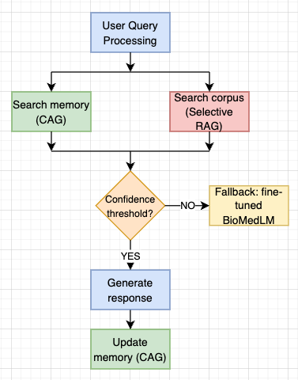

# Medical_chatbot_CAG-RAG

Author: Sagarika Singh (ss3038@rit.edu) ([LinkedIn](https://www.linkedin.com/in/sagarika-singh-938aa11bb/)) ([Google Scholar](https://scholar.google.com/citations?user=rKWm70MAAAAJ&hl=en&oi=ao))

Institution: Rochester Institute of Technology (RIT)

## About 

This project implements a medical chatbot that combines:

- CAG (Cache-Augmented Generation) via ChromaDB,

- Selective RAG (BM25 + MedCPT + RRF), and

- A fine-tuned BioMedLM model.

The system supports multi-turn conversations, reduces hallucinations, and grounds medical responses in reliable evidence.

## Project Formulation 

- We formulate the task of building a reliable medical chatbot that must balance memory retention, factual accuracy, and hallucination control. Given a user’s query Q, the system must recall relevant past interactions using CAG, retrieve factual documents using our medical corpus (selective RAG), and generate an accurate and contextually grounded response using a fine-tuned BioMedLM.

- To achieve this, we construct a novel architecture that integrates CAG, powered by ChromaDB and MiniLM, to preserve multi-turn context across sessions, selective RAG, using a dual retriever setup (BM25 and MedCPT) fused via RRF for lexical and semantic relevance and fine-tuned BioMedLM on domain-specific QA datasets to serve as the generator.

- The final chatbot operates within a confidence-aware pipeline. It prioritizes grounded responses using memory and retrieval context. If no sufficient evidence is found, the system transparently falls back to generating responses using BioMedLM’s internal knowledge. The objective is to reduce hallucinations, enhance semantic coherence, and improve user experience in long-term interactions.



## Key Experiment Results

## Training/ Testing demo

## Directory Structure

<pre> 
 medical-chatbot-project/
├── README.md
├── requirements.txt
├── figures/
├── scripts/
│   ├── cag.py
│   ├── rag_corpus.py
│   ├── fine_tune_biomedlm.py
|   ├── data_prep.py
│   └── chatbot.py
├── results/
│   ├── cag/
│   ├── rag_corpus/
│   ├── fine_tune_biomedlm/
│   └── chatbot/
</pre>


## Running the Project

Clone the repository
```bash
   git clone https://github.com/Sagarika-Singh-99/Medical_chatbot_CAG-RAG.git
   cd Medical_chatbot_CAG-RAG
```
Install dependencies
```bash
pip install -r requirements.txt
```

GPU vs CPU Requirements:
- The chatbot automatically uses GPU (via CUDA) if available.
- On CPU, performance will be slower, but all features will still work.

Model Downloads:
On the first run, the following models will be downloaded from HuggingFace:
- stanford-crfm/BioMedLM (LLM for generation)
- sentence-transformers/all-MiniLM-L6-v2 (for dense retrieval)

This may take a few minutes, depending on your internet connection.

Before running the chatbot, ensure all the files are present in the correct structure. 

To start the chatbot, run:

```bash
python chatbot.py
```

## Reference 

BioMedLM: Bolton, E., Venigalla, A., Yasunaga, M., Hall, D., Xiong, B., Lee, T., Daneshjou, R., Frankle, J., Liang, P., Carbin, M., & Manning, C.D. (2024). BioMedLM: A 2.7B Parameter Language Model Trained On Biomedical Text. ArXiv, abs/2403.18421.

Chan, Brian & Chen, Chao-Ting & Cheng, Jui-Hung & Huang, Hen-Hsen. (2024). Don't Do RAG: When Cache-Augmented Generation is All You Need for Knowledge Tasks. 10.48550/arXiv.2412.15605. 

Guangzhi Xiong, Qiao Jin, Zhiyong Lu, and Aidong Zhang. 2024. Benchmarking Retrieval-Augmented Generation for Medicine. In Findings of the Association for Computational Linguistics: ACL 2024, pages 6233–6251, Bangkok, Thailand. Association for Computational Linguistics.

Wenqi Fan, Yujuan Ding, Liangbo Ning, Shijie Wang, Hengyun Li, Dawei Yin, Tat-Seng Chua, and Qing Li. 2024. A Survey on RAG Meeting LLMs: Towards Retrieval-Augmented Large Language Models. In Proceedings of the 30th ACM SIGKDD Conference on Knowledge Discovery and Data Mining (KDD '24). Association for Computing Machinery, New York, NY, USA, 6491–6501. https://doi.org/10.1145/3637528.3671470

Bora, A., & Cuayáhuitl, H. (2024). Systematic Analysis of Retrieval-Augmented Generation-Based LLMs for Medical Chatbot Applications. Machine Learning and Knowledge Extraction, 6(4), 2355-2374. https://doi.org/10.3390/make6040116

## Datasets

MedMCQA: Pal, A., Umapathi, L.K. &amp; Sankarasubbu, M.. (2022). MedMCQA: A Large-scale Multi-Subject Multi-Choice Dataset for Medical domain Question Answering. <i>Proceedings of the Conference on Health, Inference, and Learning</i>, in <i>Proceedings of Machine Learning Research</i> 174:248-260 Available from https://proceedings.mlr.press/v174/pal22a.html.

BioASQ_task B: Tsatsaronis, G., Balikas, G., Malakasiotis, P., Partalas, I., Zschunke, M., Alvers, M. R., Weissenborn, D., Krithara, A., Petridis, S., Polychronopoulos, D., Almirantis, Y., Pavlopoulos, J., Baskiotis, N., Gallinari, P., Artiéres, T., Ngomo, A. C., Heino, N., Gaussier, E., Barrio-Alvers, L., Schroeder, M., … Paliouras, G. (2015). An overview of the BIOASQ large-scale biomedical semantic indexing and question answering competition. BMC bioinformatics, 16, 138. https://doi.org/10.1186/s12859-015-0564-6
Download dataset from here: https://participants-area.bioasq.org/datasets/

MedQuAD: Ben Abacha, A., Demner-Fushman, D. A question-entailment approach to question answering. BMC Bioinformatics 20, 511 (2019). https://doi.org/10.1186/s12859-019-3119-4
Github repo: https://github.com/abachaa/MedQuAD.git

Symptoms & Precaution dataset we created by combining and extracting multiple datasets from Kaggle. Path: Dataset/symp_pre.csv

Check: https://www.kaggle.com/datasets/itachi9604/disease-symptom-description-dataset; https://www.kaggle.com/datasets/flaredown/flaredown-autoimmune-symptom-tracker; https://www.kaggle.com/datasets/niyarrbarman/symptom2disease


## Acknowledgement 

I would like to express my sincere gratitude to Prof. Zhiqiang Tao at Rochester Institute of Technology for their invaluable guidance, feedback, and support throughout the course of this project. Their insights were instrumental in shaping the direction of this work.
 
