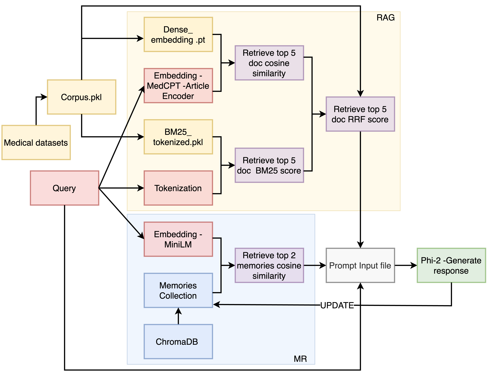
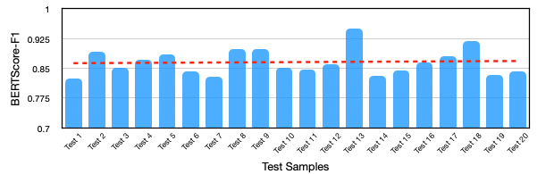

# Memory-Retrieval Chatbot: Enhancing Trust in Medical Chatbot          

Author: Sagarika Singh (ss3038@rit.edu) ([LinkedIn](https://www.linkedin.com/in/sagarika-singh-938aa11bb/)) ([Google Scholar](https://scholar.google.com/citations?user=rKWm70MAAAAJ&hl=en&oi=ao))

Institution: Rochester Institute of Technology (RIT)

RIT Capstone Project Link: 

Poster Link: 

## About 

Large Language Models (LLMs) have shown promise in healthcare applications, yet their tendency to hallucinate and forget prior context remains a critical challenge, especially in medical dialogues where factual accuracy and contextual continuity are paramount. This project introduces a hybrid memory-retrieval architecture that enhances the reliability of medical chatbots by integrating Phi-2, a lightweight 2.7B parameter LLM, with two key retrieval strategies: Memory Retrieval (MR) using ChromaDB and Advanced Retrieval-Augmented Generation (RAG) via BM25, MedCPT, and Reciprocal Rank Fusion (RRF).

ChromaDB serves as a persistent memory store, capturing user-specific interaction history for contextual anchoring in follow-up queries. Meanwhile, Selective RAG performs real-time document retrieval across a unified corpus of over 216,000 medical QA pairs, combining lexical (BM25) and semantic (MedCPT) retrieval results to improve relevance and reduce noise. The merged memory and document contexts are fed into a structured prompt, optimized to fit within Phi-2’s token window. In scenarios where no relevant content is retrieved, the model safely defaults to a "no response" fallback, further mitigating hallucinations. Evaluation on the MedQuAD dataset shows that this hybrid system significantly outperforms traditional and fine-tuned RAG baselines. It achieves a BERTScore F1 of 0.8644, indicating strong semantic alignment with ground truth answers, while maintaining a lower latency (28s) than larger models. Though perplexity is higher (12.8758), this is attributed to longer and more informative outputs due to memory inclusion.

By combining structured memory with adaptive retrieval, this architecture delivers more fluent, grounded, and trustworthy responses, marking a step forward in safe, explainable AI for medical question answering.

## Keyword

Hallucination Mitigation, ChromaDB, Advanced RAG, Phi-2, Medical Chatbot, Memory Retrieval 

## Project Formulation 

- We formulate the task of building a reliable medical chatbot that must balance memory retention, factual accuracy, and hallucination control. Given a user’s query Q, the system must recall relevant past interactions (MR-ChromaDB), retrieve factual documents using our medical corpus (Advanced RAG), and generate an accurate and contextually grounded response using Phi-2.

- To achieve this, we construct a novel architecture that integrates Memory Retrieval, powered by ChromaDB and MiniLM, to preserve multi-turn context across sessions, Advanced RAG, using a dual retriever setup (BM25 and MedCPT) fused via RRF for lexical and semantic relevance and Phi-2 transformer-based language model to serve as the generator.

- The objective is to reduce hallucinations, enhance semantic coherence, and improve user experience in long-term interactions.

## Directory Structure

<pre> 
 medical-chatbot-project/
├── README.md
├── requirements.txt
├── figures/
├── scripts/
│   ├── cag.py
│   ├── rag_corpus.py
|   ├── dataset_prep.py
│   └── chatbot.py
├── results/
│   ├── cag/
│   ├── rag_corpus/
│   └── chatbot/
</pre>

## Key Experiment Steps

### 1. Medical Corpus - Selective RAG
- Created Medical corpus using datasets - MedQuAD, MedMCQA, BioASQ_taskB, Symptoms & Precautions (from Kaggle)
- Number of samples: 216,102 (corpus.pkl)
- Column Names: ['doc_id', 'text', 'title', 'source', 'category', 'meta_json']
- Retrieval methods used - BM25, MedCPT and Reciprocal Rank Fusion (RRF).
- BM25 (Word match): BM25_tokenized.pkl is created (only 'text'), which is the tokenized version of the corpus.pkl, using rank-bm25 package and BM250kapi. 
- MedCPT (Semantic match): dense_embeddings.pt is created (only 'text'), which has the embeddings of the corpus.pkl, using ncbi/MedCPT-Article-Encoder (dimension = 768).
- This will help reduce hallucinations and ground medical responses in reliable evidence.

### 2. Reciprocal Rank Fusion
- After the top 5 documents are retrieved through BM25_tokenized.pkl using BM25 score and dense_embeddings.pt using cosine similarity, using RRF score, we further select top 5 documents.
- RRF formula: score = 1/(60 + rank).
- Documents found by both methods have the highest priority.
- When documents have the same score and are found in different methods, then priority is given to the documents in BM25 system. One document of MedCPT system was for sure included.

### 3. Memory Retrieval via ChromaDB
- Memory vector database is created using chromadb, and embedding used is 'all-MiniLM-L6-v2' (dimension = 384).
- User query with bot response is stored here.
- This will be retrieved when running the chatbot for providing past conversations context, to improve multi-turn conversations, and improve prompt memory.
- Memories are extracted using Cosine Similarity with a threshold of 0.4, and a maximum of 2 memories are selected. 

### 4. Prompt input file
- Retrieved memory and retrieved documents from RAG are put in this file, along with the user query and prompt instructions.
- Structure of prompt file: Instructions, Query, Documents, Memories, Answer.
- Maximum tokens = 1024
- This is used to generate the final response.

### 5. Generate Response
- A simple transformer Phi-2 is used to generate the response based on the prompt input file. 



## Training/ Testing demo

## Key Results

Comparative performance of our medical chatbot system against baseline (20 samples)

| **Metrics**       | **Mistral with RAG (baseline) [3]** | **Fine-tuned Mistral with RAG (baseline) [3]** | **Our System**         |
|-------------------|-------------------------------------|------------------------------------------------|-------------------------|
| **Dataset**       | Meadow-MedQA                        | Meadow-MedQA                                   | MedQuAD                 |
| **BERTScore F1**  | 0.181                               | 0.221                                          | 🟢 **0.8644**           |
| **Rouge-L**       | 0.2512                              | 0.221                                          | 0.2273                  |
| **Perplexity**    | 6.4691                              | 4.84                                           | 🔴 **12.8758**          |
| **Avg. Time (s)** | 78                                  | 150                                            | 🟢 **28**               |

- High BERTScore F1: strong semantic alignment with ground truth.
- Higher perplexity: slightly reduced fluency.
- Lower processing time: the model gives responses way faster.

BERTScore F1 across 20 test Q/A (MedQuAD) from our hybrid system



- Consistently high scores (+0.85) indicate strong semantic alignment with ground truth, suggesting low hallucination tendencies.

Impact of Memory Context on Performance

| **Memory Context** | **BERTScore F1**      | **Perplexity**       |
|--------------------|------------------------|-----------------------|
| **None**           | 0.8692                 | 11.595                |
| **1 Memory**       | 0.852                  | 10.23                 |
| **2 Memory**       | 🔴 **0.84727**         | 🟢 **8.69**           |

- Memory context improves fluency but does not consistently enhance semantic accuracy.

## Running the Project

Clone the repository
```bash
   git clone https://github.com/Sagarika-Singh-99/Medical_chatbot_CAG-RAG.git
   cd Medical_chatbot_CAG-RAG
```
Install dependencies
```bash
pip install -r requirements.txt
```

GPU vs CPU Requirements:
- The chatbot automatically uses GPU (via CUDA) if available.
- On CPU, performance will be slower, but all features will still work.

Model Downloads:
On the first run, the following models will be downloaded from HuggingFace:
- sentence-transformers/all-MiniLM-L6-v2 (check: https://huggingface.co/sentence-transformers/all-MiniLM-L6-v2)
- microsoft/phi-2 (check: https://huggingface.co/microsoft/phi-2)
- cbi/MedCPT-Article-Encoder (check: https://huggingface.co/ncbi/MedCPT-Article-Encoder).

This may take a few minutes, depending on your internet connection.

Before running the chatbot, ensure all the files are present in the correct structure and the paths are correct.

Before running the chatbot:
```bash
python dataset_prep.py
python rag_corpus.py
python cag.py
```
To start the chatbot, run:
```bash
python chatbot.py
```

## Datasets

1. MedMCQA: Pal, A., Umapathi, L.K. &amp; Sankarasubbu, M.. (2022). MedMCQA: A Large-scale Multi-Subject Multi-Choice Dataset for Medical domain Question Answering. <i>Proceedings of the Conference on Health, Inference, and Learning</i>, in <i>Proceedings of Machine Learning Research</i> 174:248-260 Available from https://proceedings.mlr.press/v174/pal22a.html.

2. BioASQ_task B: Tsatsaronis, G., Balikas, G., Malakasiotis, P., Partalas, I., Zschunke, M., Alvers, M. R., Weissenborn, D., Krithara, A., Petridis, S., Polychronopoulos, D., Almirantis, Y., Pavlopoulos, J., Baskiotis, N., Gallinari, P., Artiéres, T., Ngomo, A. C., Heino, N., Gaussier, E., Barrio-Alvers, L., Schroeder, M., … Paliouras, G. (2015). An overview of the BIOASQ large-scale biomedical semantic indexing and question answering competition. BMC bioinformatics, 16, 138. https://doi.org/10.1186/s12859-015-0564-6

Download dataset from here: https://participants-area.bioasq.org/datasets/

3. MedQuAD: Ben Abacha, A., Demner-Fushman, D. A question-entailment approach to question answering. BMC Bioinformatics 20, 511 (2019). https://doi.org/10.1186/s12859-019-3119-4 

Github repo: https://github.com/abachaa/MedQuAD.git

4. Symptoms & Precaution dataset we created by combining and extracting multiple datasets from Kaggle. Path: Dataset/symp_pre.csv

Check: https://www.kaggle.com/datasets/itachi9604/disease-symptom-description-dataset; https://www.kaggle.com/datasets/flaredown/flaredown-autoimmune-symptom-tracker; https://www.kaggle.com/datasets/niyarrbarman/symptom2disease

## Reference 

[1] Guangzhi Xiong, Qiao Jin, Zhiyong Lu, and Aidong Zhang. 2024. Benchmarking Retrieval-Augmented Generation for Medicine. In Findings of the Association for Computational Linguistics: ACL 2024, pages 6233–6251, Bangkok, Thailand. Association for Computational Linguistics, https://aclanthology.org/2024.findings-acl.372/

[2] Wenqi Fan, Yujuan Ding, Liangbo Ning, Shijie Wang, Hengyun Li, Dawei Yin, Tat-Seng Chua, and Qing Li. 2024. A Survey on RAG Meeting LLMs: Towards Retrieval-Augmented Large Language Models. In Proceedings of the 30th ACM SIGKDD Conference on Knowledge Discovery and Data Mining (KDD '24). Association for Computing Machinery, New York, NY, USA, 6491–6501. https://doi.org/10.1145/3637528.3671470

[3] Bora, A., & Cuayáhuitl, H. (2024). Systematic Analysis of Retrieval-Augmented Generation-Based LLMs for Medical Chatbot Applications. Machine Learning and Knowledge Extraction, 6(4), 2355-2374. https://doi.org/10.3390/make6040116

[4] Banerjee, Sourav & Agarwal, Ayushi & Singla, Saloni. (2024). LLMs Will Always Hallucinate, and We Need to Live With This, https://arxiv.org/abs/2409.05746

## Acknowledgement 

I would like to express my sincere gratitude to Prof. Zhiqiang Tao at Rochester Institute of Technology for their invaluable guidance, feedback, and support throughout the course of this project. Their insights were instrumental in shaping the direction of this work.
 
